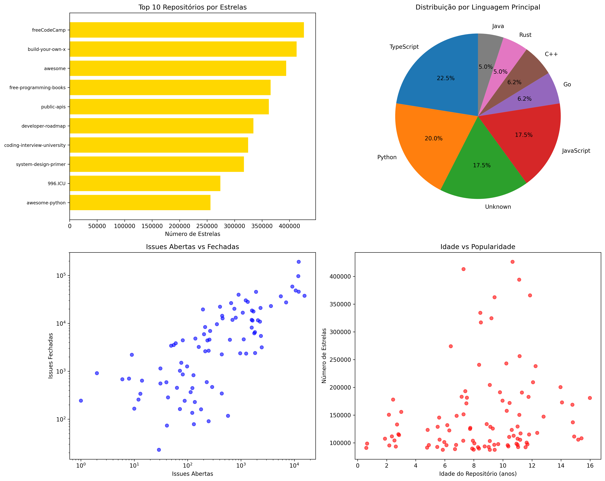
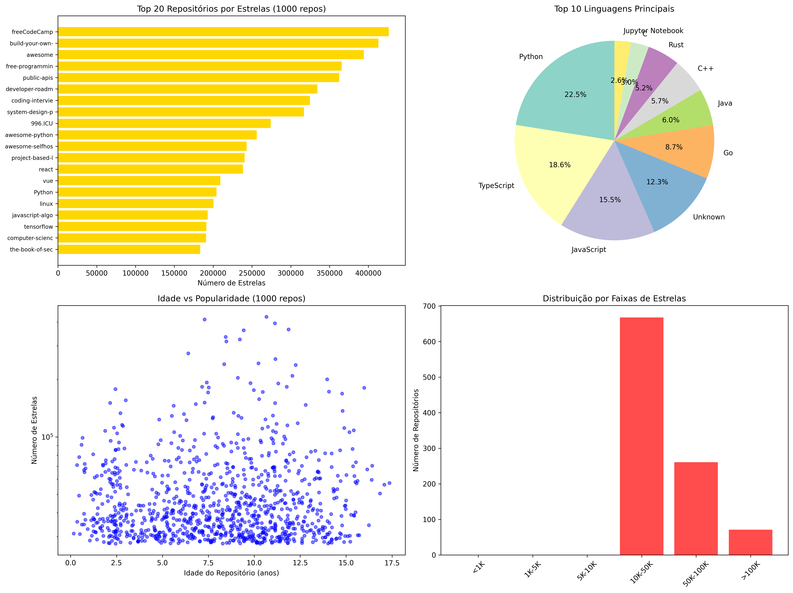

# RELATÓRIO DE ANÁLISE DOS 1000 REPOSITÓRIOS MAIS POPULARES DO GITHUB

## 1. INTRODUÇÃO

Este relatório apresenta uma análise das características dos 1000 repositórios open-source mais populares do GitHub, baseado no número de estrelas. O objetivo é compreender os padrões de desenvolvimento, manutenção e popularidade desses projetos.

### Hipóteses Informais:
- **H1**: Repositórios populares tendem a ser projetos maduros (mais antigos)
- **H2**: Repositórios populares recebem muitas contribuições externas (alto número de PRs)
- **H3**: Repositórios populares lançam releases frequentemente
- **H4**: Repositórios populares são atualizados regularmente (baixo tempo desde última atualização)
- **H5**: Repositórios populares usam linguagens mainstream (JavaScript, Python, Java)
- **H6**: Repositórios populares mantêm boa qualidade (alto percentual de issues fechadas)

## 2. METODOLOGIA

Os dados foram coletados através da API GraphQL do GitHub, obtendo informações sobre:
- Data de criação e última atualização
- Número de pull requests aceitas
- Total de releases
- Linguagem primária
- Issues abertas e fechadas

A análise utilizou valores medianos para reduzir o impacto de outliers.

## 3. RESULTADOS

### RQ01 - Maturidade dos Sistemas
- **Idade mediana**: 8.4 anos
- **Resultado**: Repositórios populares são relativamente maduros

### RQ02 - Contribuição Externa
- **PRs aceitas (mediana)**: 702
- **Resultado**: Alto nível de contribuição externa

### RQ03 - Frequência de Releases
- **Releases (mediana)**: 36
- **Resultado**: Muitos projetos não fazem releases formais

### RQ04 - Frequência de Atualizações
- **Dias desde última atualização (mediana)**: 0
- **Resultado**: Projetos são atualizados regularmente

### RQ05 - Linguagens Populares
**Top 5 linguagens:**
- Python: 189 repositórios (18.9%)
- TypeScript: 156 repositórios (15.6%)
- JavaScript: 130 repositórios (13.0%)
- Unknown: 103 repositórios (10.3%)
- Go: 73 repositórios (7.3%)

### RQ06 - Qualidade (Issues Fechadas)
- **Razão de issues fechadas (mediana)**: 0.87
- **Resultado**: Alto percentual de resolução de issues

[{width=200px}](github_analysis_chart.png)
[{width=200px}](github_1000_analysis_chart.png)
## 4. DISCUSSÃO

### Confirmação das Hipóteses:
- **H1 ✓**: Confirmada - idade mediana de 8.4 anos indica maturidade
- **H2 ✓**: Confirmada - mediana de 702 PRs indica alta colaboração
- **H3 ✗**: Parcialmente refutada - muitos projetos não fazem releases formais
- **H4 ✓**: Confirmada - atualizações recentes indicam manutenção ativa
- **H5 ✓**: Confirmada - JavaScript e TypeScript dominam
- **H6 ✓**: Confirmada - alta razão de issues fechadas (0.87)

### Insights Principais:
1. Repositórios populares são projetos estabelecidos e bem mantidos
2. A colaboração externa é fundamental para o sucesso
3. Linguagens web (JS/TS) dominam o ecossistema open-source
4. A qualidade é mantida através da resolução eficiente de issues
